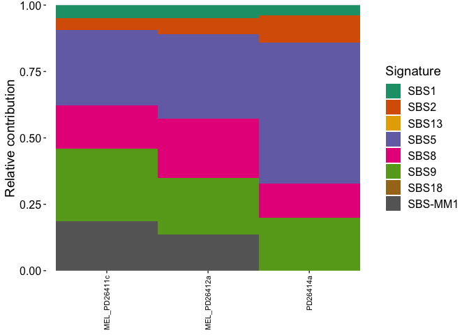
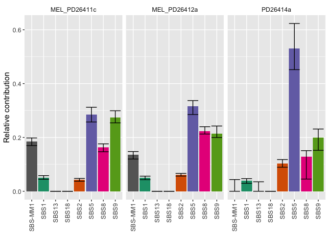

<!-- README.md is generated from README.Rmd. Please edit that file -->

# mmsig

<!-- badges: start -->

<!-- badges: end -->

The goal of mmsig is to provide a flexible and easily interpretable
mutational signature analysis tool. mmsig was developed for
hematological malignancies, but can be extended to any cancer with a
well-known mutational signature landscape.

mmsig is based on an expectation maximization algorithm for mutational
signature fitting and applies cosine similarities for dynamic error
suppression as well as bootstrapping-based confidence intervals and
assessment of transcriptional strand bias.

## Installation

You can install the development version from
[GitHub](https://github.com/) with:

``` r
# install.packages("devtools")
devtools::install_github("evenrus/mmsig@dev")
```

# Example

This is a basic example which shows mmsig usage

``` r
library(mmsig)

data(mm_5_col)
data(signature_ref)
```

## setting up the mutational signature reference

``` r
# remove canonical AID (SBS84) for genome-wide analysis
# remove the platinum signature (SBS35) because the patients are not platinum exposed

sig_ref <- signature_ref[c("sub", "tri", "SBS1", "SBS2", "SBS5", "SBS8", 
                           "SBS9", "SBS13", "SBS18", "SBS-MM1")] 

head(sig_ref)
#>   sub tri     SBS1     SBS2    SBS5    SBS8     SBS9    SBS13   SBS18
#> 1 C>A ACA 0.000886 5.80e-07 0.01200 0.04410 0.000558 0.001820 0.05150
#> 2 C>A ACC 0.002280 1.48e-04 0.00944 0.04780 0.004090 0.000721 0.01580
#> 3 C>A ACG 0.000177 5.23e-05 0.00185 0.00462 0.000426 0.000264 0.00243
#> 4 C>A ACT 0.001280 9.78e-05 0.00661 0.04700 0.003050 0.000348 0.02140
#> 5 C>A CCA 0.000312 2.08e-04 0.00743 0.04010 0.004800 0.001400 0.07400
#> 6 C>A CCC 0.001790 9.53e-05 0.00614 0.03880 0.001920 0.000968 0.01960
#>      SBS-MM1
#> 1 0.00000382
#> 2 0.00000696
#> 3 0.00005140
#> 4 0.00003070
#> 5 0.02199082
#> 6 0.00000258
```

## Setting up the mutation data

``` r
# subset three samples to reduce run time

mm_5_col_subset <- mm_5_col[mm_5_col$sample %in% c("MEL_PD26412a", "MEL_PD26411c", "PD26414a"),]
head(mm_5_col_subset)
#>             sample  chr     pos ref alt
#> 96207 MEL_PD26411c chr1 1606928   G   C
#> 96208 MEL_PD26411c chr1 2900399   C   T
#> 96209 MEL_PD26411c chr1 3003910   G   A
#> 96210 MEL_PD26411c chr1 3085231   A   G
#> 96211 MEL_PD26411c chr1 3435711   A   G
#> 96212 MEL_PD26411c chr1 4074739   A   T
```

## Perform mutational signature analysis

``` r
# Bootstrapping large datasets with many iterations can significantly increase runtime. 

sig_out <- mm_fit_signatures(muts.input=mm_5_col_subset, 
                             sig.input=sig_ref,
                             input.format = "vcf",
                             sample.sigt.profs = NULL, 
                             strandbias = F,
                             bootstrap = T,
                             iterations = 20, # 1000 iterations recommended for stable results
                             refcheck=TRUE,
                             cos_sim_threshold = 0.01,
                             ref_genome = "BSgenome.Hsapiens.UCSC.hg19",
                             dbg=FALSE) 
#>   |                                                                              |                                                                      |   0%  |                                                                              |=======================                                               |  33%  |                                                                              |===============================================                       |  67%  |                                                                              |======================================================================| 100%
```

## Plot signature estimates

``` r
plot_signatures(sig_out$estimate, 
                samples = T, 
                sig_order = c("SBS1", "SBS2", "SBS13", "SBS5", "SBS8", "SBS9", 
                              "SBS18", "SBS-MM1", "SBS35"))
```



## Plot bootstraping confidence intervals

``` r
bootSigsPlot(sig_out$bootstrap)
```


